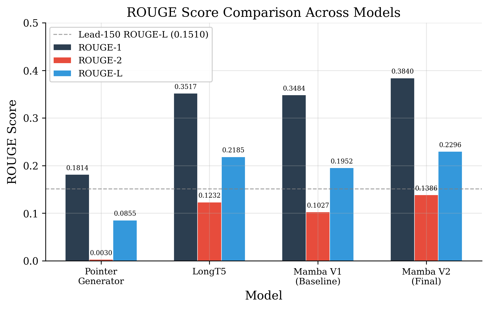
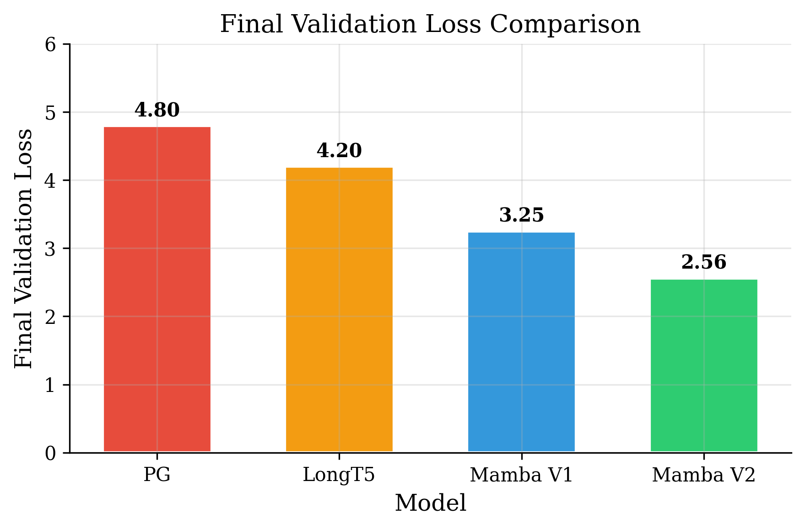
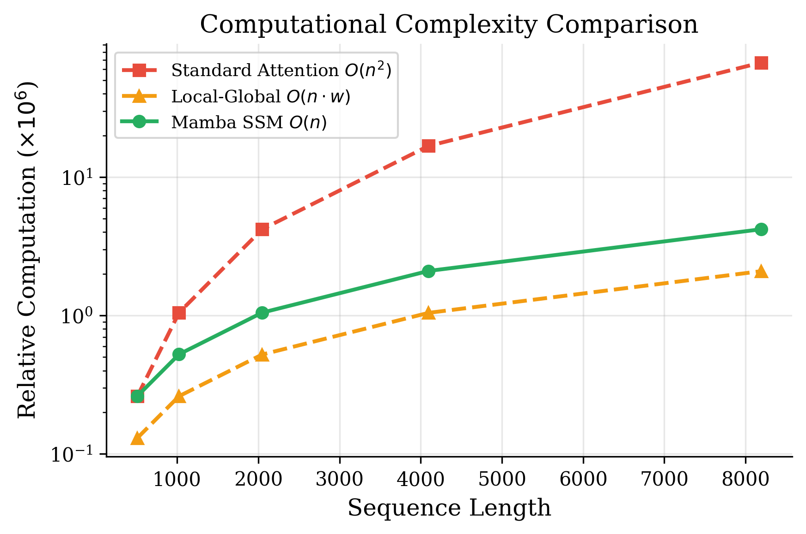
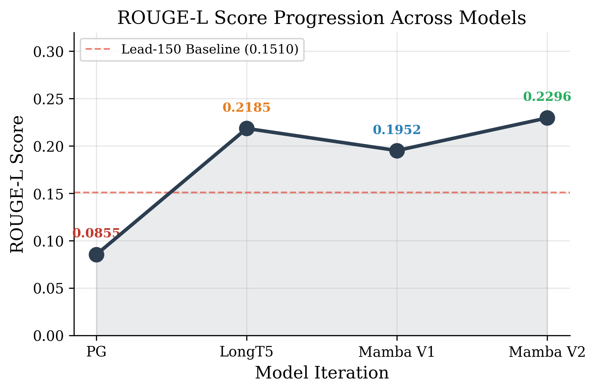

<p align="center">
  
</p>

<h1 align="center">Clinical Data Summarization</h1>

<p align="center">
  <strong>A Comparative Study of Pointer-Generator, LongT5, and Mamba-Transformer Hybrid Models</strong><br/>
  <em>AIE315: Natural Language Processing — S6 AIE Batch B, Group 5</em>
</p>

<p align="center">
  <a href="#models">Models</a> •
  <a href="#results">Results</a> •
  <a href="#quick-start">Quick Start</a> •
  <a href="#project-structure">Structure</a> •
  <a href="#team">Team</a>
</p>

---

## Overview

This project presents a **systematic progression** through four neural architectures for automated clinical discharge summary generation using the **MIMIC-IV Brief Hospital Course (BHC)** dataset (270K+ samples). Each successive model addresses specific limitations identified in its predecessor, culminating in a Mamba-Transformer Hybrid V2 that achieves state-of-the-art results on this task.

### Key Contribution

> We demonstrate that combining **Mamba's linear-time state space encoding** with a **gated cross-attention Transformer decoder** produces clinically meaningful summaries that surpass both extractive baselines and earlier neural approaches, while operating within the constraints of a single consumer GPU (RTX 4070, 8 GB).

---

## Models

| # | Model | Parameters | Max Input | ROUGE-1 | ROUGE-2 | ROUGE-L | Status |
|---|-------|-----------|-----------|---------|---------|---------|--------|
| 1 | [Pointer-Generator](models/01_pointer_generator/) | 22.5M | 768 tokens | 0.1814 | 0.0030 | 0.0855 | Baseline |
| 2 | [LongT5](models/02_longt5/) | 12.5M | 4,096 tokens | 0.3517 | 0.1232 | 0.2185 | Improved |
| 3 | [Mamba V1](models/03_mamba_v1/) | 52.1M | 4,096 tokens | 0.3484 | 0.1027 | 0.1952 | Experimental |
| 4 | **[Mamba V2](models/04_mamba_v2/)** | **79.4M** | **4,096 tokens** | **0.3840** | **0.1386** | **0.2296** | **Best** |

### Progression Summary

```
Pointer-Generator → LongT5 → Mamba V1 → Mamba V2
   (768 tok)       (4K tok)   (SSM enc)   (BiMamba + Gated Cross-Attn)
   R-L: 0.085      R-L: 0.219  R-L: 0.195  R-L: 0.230 ✓ BEST
```

**Mamba V2 improvements over baseline:**
- **ROUGE-1:** +111.7% vs Pointer-Generator
- **ROUGE-2:** +4,520% vs Pointer-Generator
- **ROUGE-L:** +168.5% vs Pointer-Generator

---

## Results

### ROUGE Score Comparison
<p align="center">
  
</p>

### Training Loss Progression
<p align="center">
  
</p>

### Model Complexity Analysis
<p align="center">
  
</p>

### ROUGE-L Progression Over Training
<p align="center">
  
</p>

---

## Quick Start

### Prerequisites
```bash
pip install -r requirements.txt
```

### Data Preparation
```bash
# Place mimic-iv-bhc.csv in data/raw/
python scripts/shared/preprocess_data.py
```

### Training Each Model

<details>
<summary><strong>Model 1: Pointer-Generator</strong></summary>

```bash
cd models/01_pointer_generator
python src/train.py --config configs/default.yaml
python src/evaluate.py  # Evaluate on validation set
```
</details>

<details>
<summary><strong>Model 2: LongT5</strong></summary>

```bash
cd models/02_longt5
python src/train.py --config configs/config.yaml
python src/inference.py  # Run inference with beam search
```
</details>

<details>
<summary><strong>Model 3: Mamba V1</strong></summary>

```bash
cd models/03_mamba_v1
python src/train.py --config configs/default.yaml
python src/evaluate.py  # Evaluate with ROUGE metrics
```
</details>

<details>
<summary><strong>Model 4: Mamba V2 (Best)</strong></summary>

```bash
cd models/04_mamba_v2
python src/train.py --config configs/full_train.yaml
python scripts/comprehensive_eval.py  # Full evaluation suite

# Launch web interface
python webapp/app.py  # Gradio UI
# or
python webapp/server.py  # Flask UI
```
</details>

---

## Project Structure

```
Clinical-Data-Summarization/
│
├── README.md                          # This file
├── requirements.txt                   # Python dependencies
│
├── data/                              # Shared dataset
│   ├── raw/                           # Raw MIMIC-IV-BHC CSV
│   ├── tokenized/                     # Preprocessed Parquet files
│   ├── tokenizer/                     # SentencePiece models (16K vocab)
│   └── sample/                        # Sample data for testing
│
├── models/                            # ★ Four models, each self-contained
│   ├── 01_pointer_generator/          # BiLSTM + Attention + Copy mechanism
│   │   ├── src/                       # Core model, training, evaluation code
│   │   ├── configs/                   # YAML configurations
│   │   ├── scripts/                   # Evaluation & analysis scripts
│   │   ├── checkpoints/               # Saved model weights
│   │   ├── logs/                      # Training logs & metrics
│   │   ├── visualizations/            # Architecture diagrams (GraphViz)
│   │   └── README.md
│   │
│   ├── 02_longt5/                     # Local-Global Attention Transformer
│   │   ├── src/                       # Model, training, inference code
│   │   ├── configs/                   # YAML configurations
│   │   ├── scripts/                   # Testing & sanity check scripts
│   │   ├── docs/                      # Architecture & issue resolution docs
│   │   ├── visualizations/            # 11 architecture diagrams
│   │   └── README.md
│   │
│   ├── 03_mamba_v1/                   # Mamba SSM Encoder + Transformer Decoder
│   │   ├── src/                       # Core Mamba-Transformer hybrid code
│   │   ├── configs/                   # V1 configurations
│   │   ├── scripts/                   # Evaluation & utility scripts
│   │   ├── checkpoints/               # BART baseline + V1 checkpoints
│   │   ├── logs/                      # Training logs
│   │   └── README.md
│   │
│   └── 04_mamba_v2/                   # ★ Best Model — Enhanced Hybrid
│       ├── src/                       # BiMamba + RMSNorm + SwiGLU + Gated XAttn
│       ├── configs/                   # Full training configs (150K steps)
│       ├── scripts/                   # Eval, monitoring, patches
│       │   └── patches/               # Bug fixes & OOM patches
│       ├── checkpoints/               # Best model + milestone checkpoints
│       ├── logs/                      # Complete training logs
│       ├── docs/                      # Architecture, math, clinical metrics
│       ├── webapp/                    # Gradio + Flask web interfaces
│       │   └── templates/
│       ├── requirements.txt
│       └── README.md
│
├── experiments/                       # ROUGE tracking & baseline results
├── results/                           # Analysis outputs & visualizations
│   ├── notebook_analysis/             # Detailed ROUGE distributions
│   └── example_outputs/               # Sample model outputs
│
├── presentation/                      # LaTeX Beamer presentation (45 slides)
│   ├── main.tex                       # Source
│   ├── generate_plots.py              # Plot generation script
│   └── figures/                       # 27 publication-quality plots (PNG+PDF)
│
├── docs/                              # Shared project documentation
│   ├── implementation_summary.md
│   ├── model_architecture.md
│   ├── rouge_optimization_plan.md
│   └── training_speed_optimization.md
│
└── scripts/                           # Shared utility scripts
    └── shared/                        # Preprocessing, inspection, analysis
```

---

## Dataset

| Property | Value |
|----------|-------|
| **Source** | MIMIC-IV Brief Hospital Course (BHC) |
| **Samples** | 270,000+ |
| **Train / Val** | 256,500 (95%) / 13,500 (5%) |
| **Source Length** | 1,000–8,000 tokens |
| **Target Length** | 50–400 tokens |
| **Compression** | ~10–20× |
| **Tokenizer** | SentencePiece Unigram (16K vocab) |

---

## Architecture Highlights

### Model 4: Mamba V2 (Best Performer)

```
Input Clinical Note [4096 tokens]
       │
       ▼
SentencePiece Tokenization [16K vocab]
       │
       ▼
Chunking: 16 chunks × 256 tokens
       │
       ▼
BiMamba Encoder ×6 [Fwd+Bwd SSM + Gated Fusion + RMSNorm + SwiGLU]
       │                    │
       ▼                    ▼
Memory Compressor      Source Bypass (every 8th token)
[32 queries/chunk]          │
       │                    │
       ▼                    │
Cross-Chunk Attention ×2    │
       │                    │
       ▼────────────────────┘
Concat: Memory (512) + Bypass (~64) tokens
       │
       ▼
Transformer Decoder ×6 [Causal Self-Attn + Additive Gated Cross-Attn + SwiGLU]
       │
       ▼
Output → Logits [16,000] → Summary
```

**Key innovations in V2:**
- **BiMamba SSM Encoder** — bidirectional state space modeling with O(n) complexity
- **Gated Cross-Attention** — additive gating fixes the cross-attention suppression bug from V1
- **Source Bypass** — preserves fine-grained token-level detail alongside compressed memory
- **SwiGLU + RMSNorm** — modern activation and normalization for improved training dynamics
- **Memory Token Compression** — 4,096 → 512 tokens (87.5% reduction in decoder attention cost)

---

## Training Details

| Setting | Pointer-Gen | LongT5 | Mamba V1 | Mamba V2 |
|---------|------------|--------|----------|----------|
| Optimizer | Adam | Adam | AdamW | AdamW |
| Learning Rate | 3e-4 | 3e-4 | 3e-4 | 3e-4 |
| Weight Decay | — | — | 0.03 | 0.03 |
| Batch Size (eff.) | 16 | 16 | 16 | 16 |
| Mixed Precision | FP16 | FP16 | FP16 | FP16 |
| Gradient Clipping | 1.0 | 1.0 | 1.0 | 1.0 |
| Training Steps | 500 | — | 40K | 150K |
| Scheduler | Cosine | Cosine | Cosine | Cosine w/ Restarts |
| GPU | RTX 4070 8GB | RTX 4070 8GB | RTX 4070 8GB | RTX 4070 8GB |

---

## Evaluation

### ROUGE Metrics (Primary)
| Model | ROUGE-1 | ROUGE-2 | ROUGE-L | Val Loss |
|-------|---------|---------|---------|----------|
| Lead-150 Baseline | 0.2523 | — | 0.1510 | — |
| Pointer-Generator | 0.1814 | 0.0030 | 0.0855 | 4.80 |
| LongT5 | 0.3517 | 0.1232 | 0.2185 | 4.20 |
| Mamba V1 | 0.3484 | 0.1027 | 0.1952 | 3.25 |
| **Mamba V2** | **0.3840** | **0.1386** | **0.2296** | **2.56** |

### Clinical Evaluation Framework (Proposed)
1. **Gate 1 — Safety:** PHI leakage, negation consistency, contradiction rate
2. **Gate 2 — Clinical Accuracy:** MEDCON (UMLS F1), Medical Entity F1, ICD-10 coverage
3. **Gate 3 — Semantic Quality:** BERTScore (Bio_ClinicalBERT), BARTScore
4. **Gate 4 — Surface Overlap:** ROUGE-1/2/L, repetition rate, length ratio

---

## Team

| Roll Number | Name |
|-------------|------|
| CB.SC.U4AIE23103 | Anto Risath |
| CB.SC.U4AIE23104 | Antonio Roger |
| CB.SC.U4AIE23109 | Adarsh Pradeep |
| CB.SC.U4AIE23165 | Naresh Kumar V |

**Course:** AIE315 — Natural Language Processing  
**Section:** S6 AIE Batch B — Group 5

---

## References

1. See, A., Liu, P. J., & Manning, C. D. (2017). *Get To The Point: Summarization with Pointer-Generator Networks.* ACL 2017.
2. Guo, M., et al. (2022). *LongT5: Efficient Text-To-Text Transformer for Long Sequences.* NAACL 2022.
3. Gu, A., & Dao, T. (2023). *Mamba: Linear-Time Sequence Modeling with Selective State Spaces.* arXiv:2312.00752.
4. Johnson, A., et al. (2023). *MIMIC-IV: A freely accessible electronic health record dataset.* Scientific Data.
5. Vaswani, A., et al. (2017). *Attention Is All You Need.* NeurIPS 2017.
6. Shazeer, N. (2020). *GLU Variants Improve Transformer.* arXiv:2002.05202.
7. Zhang, B., & Sennrich, R. (2019). *Root Mean Square Layer Normalization.* NeurIPS 2019.

---

<p align="center">
  <em>Built with PyTorch • Trained on NVIDIA RTX 4070 (8 GB) • MIMIC-IV Dataset</em>
</p>
